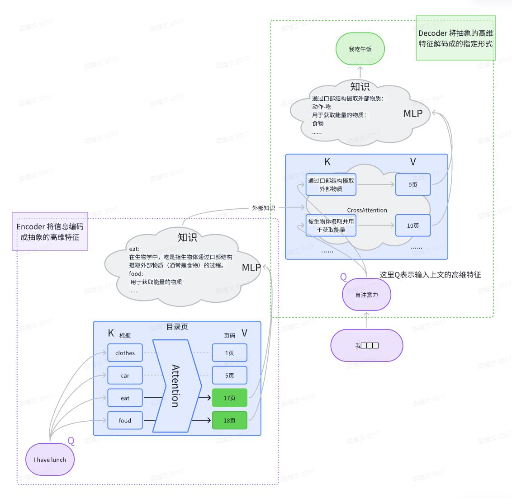
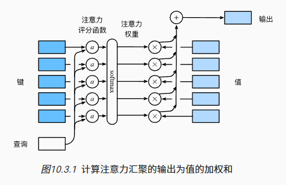

# transformer-blog

https://www.cnblogs.com/gaobw/p/18265137


## 简介
Transformer是一种深度学习模型，它在自然语言处理（NLP）领域中非常流行和有效。它最初由Vaswani等人在2017年的论文《Attention is All You Need》中提出。Transformer模型的核心思想是使用自注意力（Self-Attention）机制来处理序列数据，这使得模型能够在处理长距离依赖关系时表现出色。  

近年来，Transformer不仅仅局限于NLP领域，已经广泛应用于 图像识别(ViT)、图像生成(DiT)、语音识别(Hubert)、大语言模型(ChatGPT)、智能驾驶、人形机器人等领域。其中的注意力模块已经是各种大型深度网络中的标准模块。





```python
# !wget -O en-zh.tsv "https://tatoeba.org/zh-cn/exports/download/48735/%E6%9C%89%E8%8B%B1%E8%AF%AD-%E4%B8%AD%E6%96%87%E6%99%AE%E9%80%9A%E8%AF%9D%E5%AF%B9%E5%BA%94%E5%8F%A5%20-%202024-06-11.tsv"
# 将繁体转成简体
# !pip install zhconv
# !pip install sentencepiece
# !apt install sentencepiece -y
```


```python
import os
os.environ['CUDA_LAUNCH_BLOCKING'] = '1'

import torch
import numpy as np
import pandas as pd
from torch.utils.data import Dataset
from torch.utils.data import DataLoader

import torch.nn as nn
import torch.nn.functional as F
from torch.autograd import Variable

import math

import sentencepiece as spm
from zhconv import convert


def Q2B(uchar):
  """判断一个unicode是否是全角数字"""
  if uchar >= u'\uff10' and uchar <= u'\uff19':
    """单个字符 全角转半角"""
    inside_code = ord(uchar)
    if inside_code == 0x3000:
        inside_code = 0x0020
    else:
        inside_code -= 0xfee0
    if inside_code < 0x0020 or inside_code > 0x7e: #转完之后不是半角字符返回原来的字符
        return uchar
    return chr(inside_code)
  else:
    return uchar

def stringpartQ2B(ustring):
  return "".join([Q2B(uchar) for uchar in ustring])


def convertSimple(x):
  return stringpartQ2B(convert(x.values[0], 'zh-cn'))


all_data = pd.read_csv('en-zh.tsv',sep='\t',on_bad_lines='skip',names=['NO.1','en','NO.2','zh'])
# 繁体转简体
zh_data = all_data.iloc[:,[3]].apply(convertSimple, axis=1).rename('zhs',inplace=True)

all_data = pd.concat([all_data.iloc[:,[1]], zh_data], axis=1)

# 追加第二个数据集
data_b = pd.read_json('train.json')

all_data = pd.DataFrame({"en": np.append(all_data.iloc[:,[0]].values, data_b.iloc[:,[0]].values), 'zh': np.append(all_data.iloc[:,[1]].values, data_b.iloc[:,[1]].values)})

# 文本进行排序
all_data["Length"] = all_data['en'].str.len()

all_data.sort_values(by='Length', inplace=True)
# all_data = all_data.applymap(lambda x: x.lower()) #英文全部转为小写

print(type(all_data))
print(type(all_data.values))
all_data
```

    <class 'pandas.core.frame.DataFrame'>
    <class 'numpy.ndarray'>


<div>
<style scoped>
    .dataframe tbody tr th:only-of-type {
        vertical-align: middle;
    }

    .dataframe tbody tr th {
        vertical-align: top;
    }

    .dataframe thead th {
        text-align: right;
    }
</style>
<table border="1" class="dataframe">
  <thead>
    <tr style="text-align: right;">
      <th></th>
      <th>en</th>
      <th>zh</th>
      <th>Length</th>
    </tr>
  </thead>
  <tbody>
    <tr>
      <th>122690</th>
      <td>4.</td>
      <td>4．</td>
      <td>2</td>
    </tr>
    <tr>
      <th>175547</th>
      <td>4.</td>
      <td>4.</td>
      <td>2</td>
    </tr>
    <tr>
      <th>72922</th>
      <td>1.</td>
      <td>1.</td>
      <td>2</td>
    </tr>
    <tr>
      <th>224032</th>
      <td>2.</td>
      <td>2.</td>
      <td>2</td>
    </tr>
    <tr>
      <th>106489</th>
      <td>4.</td>
      <td>4.</td>
      <td>2</td>
    </tr>
    <tr>
      <th>...</th>
      <td>...</td>
      <td>...</td>
      <td>...</td>
    </tr>
    <tr>
      <th>161550</th>
      <td>Commentators seem to agree that the voters who...</td>
      <td>奥巴马不断把希拉里·克林顿与在2001年到2007年主导华盛顿的思维联系起来。 更为不同寻常...</td>
      <td>762</td>
    </tr>
    <tr>
      <th>100443</th>
      <td>Third, the narcissism of small differences and...</td>
      <td>第三，除了微小差异的自恋以及布什的伊拉克战争之外，美国人和欧洲人具有共同的生活方式，并且在文...</td>
      <td>844</td>
    </tr>
    <tr>
      <th>204260</th>
      <td>This looming global recession is being fed by ...</td>
      <td>降低了美国的贸易伙伴的竞争力的美元的弱势； 迫使各国中央银行在增长和金融稳定有严重下行风险的...</td>
      <td>844</td>
    </tr>
    <tr>
      <th>193072</th>
      <td>So we have Paul Samuelson, the author of the p...</td>
      <td>因此，我们有了战后标志性的经济学教材的作者保罗·萨缪尔森，提醒经济学家同仁中国在全球化中的进...</td>
      <td>913</td>
    </tr>
    <tr>
      <th>111754</th>
      <td>Relations between the US and Europe have gone ...</td>
      <td>对于像大西洋联盟这样很少进入普通选民意识的问题侯选人并没有动力来予以关注。 奥巴马主持参议员...</td>
      <td>1027</td>
    </tr>
  </tbody>
</table>
<p>245621 rows × 3 columns</p>
</div>


```python
# 中英文分别保存txt
# with open('en.txt', 'w', encoding='utf-8') as f:
#     for x in all_data.iloc[:,[0]].values:
#         f.write(x[0] + '\n')

# with open('zh.txt', 'w', encoding='utf-8') as f:
#     for x in all_data.iloc[:,[1]].values:
#         f.write(x[0] + '\n')


import sentencepiece as spm
# 根据词频词性训练分词模型
# !spm_train --input=en.txt --model_prefix=en_tokenizer --vocab_size=32000 --model_type=bpe --character_coverage=1 --pad_id=0 --unk_id=1 --bos_id=2 --eos_id=3
# !spm_train --input=zh.txt --model_prefix=zh_tokenizer --vocab_size=32000 --model_type=bpe --character_coverage=0.9995 --pad_id=0 --unk_id=1 --bos_id=2 --eos_id=3
# 生成 zh_tokenizer.model 和 en_tokenizer.model

sp = spm.SentencePieceProcessor()
sp.Load("zh_tokenizer.model")

text = "她住海边，可还是不会游泳。"
print(sp.EncodeAsPieces(text))
print(sp.EncodeAsIds(text))
print(sp.decode_ids(sp.EncodeAsIds(text)))

```

    ['▁她', '住', '海边', ',', '可', '还是', '不会', '游泳', '。']
    [129, 29248, 15399, 28603, 28632, 219, 124, 2838, 28602]
    她住海边,可还是不会游泳。


```python
# 根据每个句子的长度，进行padding，使每行的长度一致
# torch.nn.utils.rnn.pad_sequence(sequences, batch_first=False, padding_value=0.0)
# sequences(list[Tensor]) 每行的数据长短不一的list
# batch_first batch_size是否在第一维度
# padding_value 填充值
# a = torch.Tensor([1])
# b = torch.Tensor([2,2])
# c = torch.Tensor([3,3,3])
# d = torch.Tensor([4,4,4,4,4,4])
# pad_test = torch.nn.utils.rnn.pad_sequence([a,b,c,d],batch_first=True)
# pad_test
#torch.Tensor([[1, 1],[2,2]])

# tensor([[1., 0., 0., 0., 0., 0.],
#         [2., 2., 0., 0., 0., 0.],
#         [3., 3., 3., 0., 0., 0.],
#         [4., 4., 4., 4., 4., 4.]])
```


```python
# 创建一个数据加载器，每次获取固定数量的batch，同时对batch进行补齐
class MyDataset(Dataset):
    def __init__(self, data, device="cuda"):
        self.data = data
        
        self.zh_tokenizer = spm.SentencePieceProcessor()
        self.zh_tokenizer.Load("zh_tokenizer.model")

        self.en_tokenizer = spm.SentencePieceProcessor()
        self.en_tokenizer.Load("en_tokenizer.model")

        # 加入特殊字符
        self.PAD = self.en_tokenizer.pad_id()  # 0
        self.BOS = self.en_tokenizer.bos_id()  # 2
        self.EOS = self.en_tokenizer.eos_id()  # 3
        
        self.device = device

        self.en_data = [torch.Tensor([self.BOS] + self.en_tokenizer.EncodeAsIds(en[0]) + [self.EOS]) for en in self.data.iloc[:,[0]].values]
        self.zh_data = [torch.Tensor([self.BOS] + self.zh_tokenizer.EncodeAsIds(zh[0]) + [self.EOS]) for zh in self.data.iloc[:,[1]].values]

        assert len(self.en_data) == len(self.zh_data)

    def __getitem__(self, idx):
        en_ids = self.en_data[idx]
        zh_ids = self.zh_data[idx]
        return [en_ids, zh_ids]

    def __len__(self):
        return len(self.en_data)

    @staticmethod
    def get_pad_mask(seq, pad_idx):
        # 对 PAD 做屏蔽操作
        # batch * seqlen -> batch * 1 * seqlen
        return (seq != pad_idx).unsqueeze(-2)

    @staticmethod
    def get_subsequent_mask(seq):
        # decode 不能让后面单词的注意力影响到前面的单词
        batch_size, seq_len = seq.size()
        # torch.triu 保留上三角元素，diagonal=0保留对角线，diagonal=1不保留对角线
        # 保留下三角，包括对角线。因为 decoder输入的是完整句子，对 Q 做屏蔽，使得K看不到Q后面的单词
        # Attention = Q @ K^T = Q (seq_len_q x d) @ K^T (d x seq_len_k) = (seq_len_q x seq_len_k) 
        '''
            K(memory)
         -----------
         | [1, 0, 0]
        Q| [1, 1, 0]
         | [1, 1, 1]
        '''
        subsequent_mask = (1 - torch.triu(
            torch.ones((1, seq_len, seq_len), device=seq.device), diagonal=1)).bool()
        return subsequent_mask

    def collate_fn(self, batch):
        en_ids = [torch.LongTensor(np.array(x[0])) for x in batch]
        zh_ids = [torch.LongTensor(np.array(x[1])) for x in batch]
        
        batch_en = torch.nn.utils.rnn.pad_sequence(en_ids, batch_first=True, padding_value=self.PAD)
        batch_zh = torch.nn.utils.rnn.pad_sequence(zh_ids, batch_first=True, padding_value=self.PAD)
        batch_en = batch_en.to(self.device)
        batch_zh = batch_zh.to(self.device)
        
        # 训练过程中采用 Teacher Forcing 模式, 将目标句子拆成 “<BOF>我吃午饭” 和 “我吃午饭<EOF>” 直接用目标输入去推理目标输出
        tgt_in = batch_zh[:,:-1]
        tgt_real = batch_zh[:,1:]
        src = batch_en

        # torch中的attention mask 尺寸 correct_3d_size = (bsz * num_heads, tgt_len, src_len)  => n k q
        # src 中要排除 PAD 对注意力的干扰
        src_mask = self.get_pad_mask(src, self.PAD)
        

        # decode 中要排除 PAD 和 后面单词 对注意力的干扰
        tgt_mask = self.get_pad_mask(tgt_in, self.PAD) & self.get_subsequent_mask(tgt_in)

        # torch.nn.MultiheadAttention 中的的mask True代表屏蔽，False表示通过
        # n_head = 4
        # src_mask = src_mask.repeat(n_head, 1, 1)
        # tgt_mask = tgt_mask.repeat(n_head, 1, 1)
        # src_mask = src_mask == False
        # tgt_mask = tgt_mask == False
        
        # print('src_mask', src_mask.shape, 'tgt_mask', tgt_mask.shape)
        return src, src_mask, tgt_in, tgt_real, tgt_mask

dataset = MyDataset(all_data)


dataloader = DataLoader(dataset, shuffle=False, batch_size=2,
                                  collate_fn=dataset.collate_fn)

for batch in dataloader:
    print(len(batch))
    break


# raise OSError('1111')
```

    5


## InputEmbedding
embedding层就是把单词表 [('你',1)('好',2)('吗',3)] 从id转化成向量的表示形式:  
你 -> 1 -> [0.3,0.3]  
好 -> 2 -> [0.7,0.1]  
吗 -> 3 -> [0.1,0.2]  

首先，词嵌入相较于One-Hot编码更节省空间，其次，One-Hot编码中所有词向量之间彼此正交，没有体现词与词之间的相似关系。如下图所示，向量的表示形式能够揭示词与词之间的内在联系   
  
  
  

单词的 Embedding 有很多种方式可以获取，例如可以采用 Word2Vec、Glove 等算法预训练得到，也可以在 Transformer 中训练得到。这里我们采用Transformer中训练的方式。  

nn.Embedding的基本思想是将每个整数索引映射到一个固定大小(d_model)的向量。这些向量在训练过程中是可学习的，因此可以捕获数据的潜在结构和语义信息。

$p(x)=\dfrac{1}{\sqrt{2\pi\sigma^{2}}}\mathrm{exp}({-\dfrac{1}{2}(\dfrac{x-\mu}{\sigma})^{2}})$

为何在获取输入词向量之后需要对矩阵乘以embedding size的开方？

embedding matrix的初始化方式是xavier init，这种方式的方差是 $\sigma^2=\dfrac{1}{EmbeddingSize}$, 均值$\mu=0$ ，因此乘以embedding size的开方使得embedding matrix的方差是1，在这个scale下可能更有利于embedding matrix的收敛。  
有
$\sigma^2=\dfrac{1}{n}(X-\mu)^2=\dfrac{1}{n}(X)^2=\dfrac{1}{EmbeddingSize}$  
X乘以$\sqrt{EmbeddingSize}$ 后的方差为：  
$\hat{\sigma}^2=\dfrac{1}{n}(\sqrt{EmbeddingSize}X-\mu)^2=\dfrac{1}{n}(\sqrt{EmbeddingSize} X)^2=EmbeddingSize \cdot{} \dfrac{1}{n}(X)^2 = EmbeddingSize \cdot{} \dfrac{1}{EmbeddingSize} = 1$  

```python
class InputEmbedding(nn.Module):
  def __init__(self, vocab_size, d_model):
    super(InputEmbedding, self).__init__()
    # 一个普通的 embedding 层, vocab_size词表长度， d_model每个单词的维度 
    self.embedding = nn.Embedding(vocab_size, d_model)
    self.d_model = d_model

  def forward(self,x):
    # 这里x的尺寸为 batch_size(句子个数) * seq_len（每句单词个数） * d_model（单词维度）
    x = self.embedding(x) * math.sqrt(self.d_model) 
    # print('self.embedding(x)', x)
    return x
```

## PositionalEncoding
```Positional Encoding``` 就是句子中词语相对位置的编码，让Transformer保留词语的位置息。要表示位置信息最容易想到的形式是类似坐标轴的表示[0, 1, 2, ... ， n]。又由于每个句子的长度长短不一，简单坐标表示相对位置会对模型的泛化能力造成损失。这样我们就想有一种方法使得 ```词语之间的间隔对于不同长度的句子来说，含义应该是一致的。``` 于是有了基于正弦函数和余弦函数的固定位置编码(Vaswani et al., 2017)的提出。
设每个句子中单词为 n，单词的维度为 d_model，则有输入矩阵 $X \in R^{n\times d\_model}$，位置编码矩阵 $P \in R^{n\times d\_model}$，使得$X+P∈R^{n\times d\_model}$，i∈[0, n)，2j∈[0, d_model)
$$ P_{i,2j} = sin(i/10000^{2j/d\_model}) $$
$$ P_{i,2j+1} = cos(i/10000^{2j/d\_model}) $$

乍一看，这种基于三角函数的设计看起来很奇怪。我们可以看看0-15的数字用二进制表示。
  

发现，当数字从0增大到15时，第0位的比特位变化了15次，而第3位的比特位只变化了1次；由此可见，低位的比特位变化频率高，高位的比特位变化频率低。通过j调整三角函数的频率，实现d_model每个维度都有自己特定的频率，通过i在各自频率的各自位置上实现编码。


```python
class PositionalEncoding(nn.Module):
  def __init__(self, d_model, max_len=500, device='cuda'):
    super(PositionalEncoding, self).__init__()

    # 初始化max_len×d_model的全零矩阵
    # print('max_len', max_len, 'd_model', d_model)
    pe = torch.zeros(max_len, d_model, device=device)

    """
    unsqueeze作用：扩展维度
    x = torch.Tensor([1, 2, 3, 4]) #torch.Size([4]) 一维
    torch.unsqueeze(x, 0)) #tensor([[1., 2., 3., 4.]]) torch.Size([1, 4]) 一行四列，二维
    torch.unsqueeze(x, 1))
    tensor([[1.],
        [2.],
        [3.],
        [4.]]) #torch.Size([4, 1]) 四行一列
    """
    # 上面公式 P(i,2j) 与 P(i,2j+1) 中，i∈[0, max_len)表示单词在句子中的位置 2j∈[0, d_model)表示单词的维度
    position = torch.arange(0., max_len, device=device).unsqueeze(1) # torch.Size([max_len, 1])
    # 两个公式中的 i/(10000^(2j/d_model)) 项是相同的，只需要计算一次即可
    # 这里幂运算太多，我们使用exp和log来转换实现公式中 i要除以的分母（由于是分母，要注意带负号）
    # torch.exp自然数e为底指数运算 与 math.log对数运算抵消
    div_term = torch.exp(torch.arange(0., d_model, 2, device=device) * -(math.log(10000.0) / d_model))

    # 根据公式，计算各个位置在各embedding维度上的位置纹理值，存放到pe矩阵中
    pe[:, 0::2] = torch.sin(position * div_term) #P(i,2j)=sin(...)，从0开始步长为2 表示2j
    pe[:, 1::2] = torch.cos(position * div_term) #P(i,2j+1)=cos(...)，从1开始步长为2 表示2j+1

    # 加1个batch维度，使得pe维度变为：1×max_len×d_model，方便后续与一个batch的句子所有词的embedding批量相加
    pe = pe.unsqueeze(0)
    # 将pe矩阵以持久的buffer状态存下(不会作为要训练的参数)
    self.register_buffer('pe', pe)

  def forward(self, x):
    # 将一个batch的句子所有词的embedding与已构建好的positional embeding相加后输出，且尺寸不变
    # 设 x 的句子长度为len，尺寸为 batch×len×d_model, 这里x.size(1)即为句子长度len，则 self.pe[:, :x.size(1)]尺寸为 1×len×d_model
    x = x + Variable(self.pe[:, :x.size(1)], requires_grad=False)
    return x

```

## Self-Attention
  
Self-Attention 是 Transformer中最核心的部分。  

$Attention(Q,K,V)=softmax(\dfrac{QK^T}{\sqrt{d_k}})V$

这种的形式的公式其意义到底是什么？先看 $QK^T$ :  
这里 Q K 均为行向量有  
$
QK^T=\left[
\begin{array}{cccc}
q_1 & q_2 & \cdots & q_n
\end{array}
\right]\left[
\begin{array}{c}
k_1 \\
k_2 \\
\vdots\\
k_n
\end{array}
\right]= 
\sum_{i=1}^n q_i k_i
$

$a \cdot b =a^Tb =\sum_{i=1}^{n} a_i b_i =||a||\;||b||\;cos\theta$  


向量的内积，表征一个向量在另一个向量上的投影。投影的值大，说明两个向量相关度高。如果两个向量夹角是九十度，那么这两个向量线性无关。

上述的$a$和$b$均为列向量，而公式里的 $Q$ $K$ 是行向量（batch * len * d_k ）所以点积写成 $QK^T$ 。

<!--    -->
Q K 的内积 表示了 Q中每个单词 与 K的每个单词 的关联度矩阵（注意力评分），softmax进行归一化处理使得整体的关联度之和为1

进行softmax之前需要对attention进行scaled（why divide by $\sqrt{d_k}$ ）?  
the dot products grow large in magnitude, pushing the softmax function into regions where it has extremely small gradients  
当d_k较大时，点积的幅度也就变大，容易进入softmax函数的梯度消失区域。


```python
class ScaledDotProductAttention(nn.Module):
    ''' Scaled Dot-Product Attention '''

    def __init__(self, attn_dropout=0.1):
        super().__init__()
        
        self.dropout = nn.Dropout(attn_dropout)

    def forward(self, q, k, v, mask=None):
        # shape = batch * head * len * d_k 
        # q k 计算点积，所以向量的维度 d_q 和 d_k 需要保证相等
        assert q.size(-1) == k.size(-1)

        d_k = k.size(-1)

        #计算注意力, 这里要计算单词间的关联度，最后两个维度必须保证是 len * d_k
        # attn = [batch * head * len * d_k] dot [batch * head * d_k * len]
        #      = batch * head * len = batch * head * attn_score
        attn = torch.matmul(q / math.sqrt(d_k), k.transpose(-2, -1))

        # 如果存在要进行mask的内容，则将注意力评分中需要屏蔽的部分替换成一个很大的负数
        if mask is not None:
            attn = attn.masked_fill(mask == 0, -1e9)
        # 对 attn_score 做归一化
        attn = self.dropout(F.softmax(attn, dim=-1))
        
        output = torch.matmul(attn, v)

        return output, attn
```

## 多头注意力
当给定相同的查询、键和值的集合时， 我们希望模型可以基于相同的注意力机制学习到不同的行为，然后将不同的行为作为知识组合起来，允许注意力机制组合使用查询、键和值的不同子空间表示。  
  
$X * W_{linear}^q=Q$  
$X * W_{linear}^k=K$  
$X * W_{linear}^v=V$ 


```python
class MultiHeadAttention(nn.Module):
    def __init__(self, n_head, d_model, d_k, d_v, dropout=0.1):
        super().__init__()

        self.n_head = n_head
        # k 和 v 通过注意力权重进行交互，所以d_k和d_v可以有不同的维度
        self.d_k = d_k
        self.d_v = d_v 

        self.w_qs = nn.Linear(d_model, n_head * d_k, bias=False)
        self.w_ks = nn.Linear(d_model, n_head * d_k, bias=False)
        self.w_vs = nn.Linear(d_model, n_head * d_v, bias=False)
        # 对 注意力输出 进行特征整理
        self.fc = nn.Linear(n_head * d_v, d_model, bias=False)

        self.attention = ScaledDotProductAttention()

        self.dropout = nn.Dropout(dropout)
        # 最后的维度size 进行标准化，趋近于标准高斯分布 
        self.layer_norm = nn.LayerNorm(d_model, eps=1e-6)


    def forward(self, q, k, v, attn_mask=None):
        mask = attn_mask
        d_k, d_v, n_head = self.d_k, self.d_v, self.n_head
        # batch * len * d_model
        sz_b, len_q, len_k, len_v = q.size(0), q.size(1), k.size(1), v.size(1)

        residual = q

        # 输入尺寸 batch x len x d_model
        # Separate different heads: b x lq x n x dv
        q = self.w_qs(q).view(sz_b, len_q, n_head, d_k)
        k = self.w_ks(k).view(sz_b, len_k, n_head, d_k)
        v = self.w_vs(v).view(sz_b, len_v, n_head, d_v)

        # Transpose for attention dot product: batch x head x len x d_k
        # 计算注意力要保证最后两个维度是 句子长度 * 单词维度
        q, k, v = q.transpose(1, 2), k.transpose(1, 2), v.transpose(1, 2)

        if mask is not None:
            # batch * len -> batch * 1 * len
            # 添加一个 head 维度 1，通过广播机制可以mask所有的head
            mask = mask.unsqueeze(1)   # For head axis broadcasting.

        q, attn = self.attention(q, k, v, mask=mask)

        # Transpose to move the head dimension back: b x lq x n x dv
        # Combine the last two dimensions to concatenate all the heads together: b x lq x (n*dv)
        # 把维度 batch x head x len x d_k 还原成 batch x len x d_model, 方便做残差
        q = q.transpose(1, 2).contiguous().view(sz_b, len_q, -1)
        q = self.dropout(self.fc(q))
        q += residual
        
        q = self.layer_norm(q)

        return q, attn
```

## PositionwiseFeedForward  
定位前馈网络
虽然线性变换在不同位置上是相同的，但它们在不同层之间使用不同的参数。另一种描述方法是将其描述为两个核大小为卷积。

```
后续的研究表明是Knowledge Neurons知识神经元。tokens在前一层attention做全局交互操作之后，通过FFN的参数中存放着大量training过程中学习到的比较抽象的Knowledge，每次都会进一步更新这些Knowledge。目前有些studies是说明这件事的，如   
《Transformer Feed-Forward Layers Are Key-Value Memories》  
《Knowledge Neurons in Pretrained Transformers》 
```

```
《MoEfication: Transformer Feed-forward Layers are Mixtures Experts》    
FFN 是一种混合专家模型？   
刘知远团队的论文，其实一直以来，神经网络就存在稀疏激活的现象，也就是在推理的时候，其实只有极小一部分参数参与了计算。这篇论文则通过 MoE 的思想来将 FFN 层拆分成了多个专家，并且新增了一个路由模块来确定推理的时候来挂哪个专家的门诊：）这么做完之后，在提升推理速度的同时，效果依然能保持原来的95%以上。
```


```python
class PositionwiseFeedForward(nn.Module):
    def __init__(self, d_in, d_hid, dropout=0.1):
        super().__init__()
        self.w_1 = nn.Linear(d_in, d_hid)
        self.w_2 = nn.Linear(d_hid, d_in)
        self.layer_norm = nn.LayerNorm(d_in, eps=1e-6)
        self.dropout = nn.Dropout(dropout)

    def forward(self, x):
        residual = x
        x = self.w_2(F.relu(self.w_1(x)))
        x = self.dropout(x)
        x += residual
        x = self.layer_norm(x)
        return x
```


```python
class EncoderLayer(nn.Module):
    # d_model输入特征维度，d_hid 为 PositionwiseFeed 的隐藏层维度
    def __init__(self, d_model, d_hid, n_head, d_k, d_v, dropout=0.1):
        super(EncoderLayer, self).__init__()
        self.self_attn = MultiHeadAttention(n_head, d_model, d_k, d_v, dropout=dropout)
        self.ffn = PositionwiseFeedForward(d_model, d_hid, dropout=dropout)

    def forward(self, x, src_mask=None):
        # seq_len = src_mask.shape[-1]
        # torch中的attention mask 尺寸 correct_3d_size = (bsz * num_heads, tgt_len, src_len)
        y, attn = self.self_attn(
            x, x, x, attn_mask=src_mask)
        y = self.ffn(y)
        return y, attn

class DecoderLayer(nn.Module):
    def __init__(self, d_model, d_inner, n_head, d_k, d_v, dropout=0.1):
        super(DecoderLayer, self).__init__()
        self.self_attn = MultiHeadAttention(n_head, d_model, d_k, d_v, dropout=dropout)
        self.cross_attn = MultiHeadAttention(n_head, d_model, d_k, d_v, dropout=dropout)
        self.ffn = PositionwiseFeedForward(d_model, d_inner, dropout=dropout)

    def forward(self, x, encoder_y, tgt_mask=None, cross_attn_mask=None):
        # print(x.shape, tgt_mask.shape)

        # decoder 自注意力
        # tgt_mask2 = torch.zeros((tgt_mask.shape[0], tgt_mask.shape[1], tgt_mask.shape[2]), device=tgt_mask.device).bool()
        
        decoder_y, decoder_attn = self.self_attn(x, x, x, attn_mask=tgt_mask)
        
        
        knowledge = encoder_y
        # 交叉注意力层
        # 这里的 decoder_y, encoder_y, encoder_y 理解成 Xq Xk Xv
        # 用 decoder 的 q 去 查询 encode 的 k-v 里的关联信息
        decoder_y, cross_attn = self.cross_attn(
            decoder_y, knowledge, knowledge, attn_mask=cross_attn_mask)
        
        decoder_y = self.ffn(decoder_y)
        return decoder_y, decoder_attn, cross_attn


class Encoder(nn.Module):
    def __init__(self, n_layers, d_model, n_head, hidden_scaler=4):
        super().__init__()

        assert d_model % n_head == 0
        # 512 / 8 = 64
        d_k = d_v = d_model //  n_head

        # 输入前 先标准化
        self.dropout = nn.Dropout(0.1)
        self.layer_norm = nn.LayerNorm(d_model, eps=1e-6)
        
        self.layer_stack = nn.ModuleList([
            EncoderLayer(d_model, d_model * hidden_scaler, n_head, d_k, d_v)
            for _ in range(n_layers)])
        

    def forward(self, src_vecs, src_mask):

        encoder_y = self.layer_norm(self.dropout(src_vecs))

        for enc_layer in self.layer_stack:
            encoder_y, enc_slf_attn = enc_layer(encoder_y, src_mask)

        return encoder_y


class Decoder(nn.Module):
    def __init__(self, n_layers, d_model, n_head, hidden_scaler=4):
        super().__init__()

        assert d_model % n_head == 0
        # 512 / 8 = 64
        d_k = d_v = d_model //  n_head

        self.dropout = nn.Dropout(0.1)
        self.layer_norm = nn.LayerNorm(d_model, eps=1e-6)

        self.layer_stack = nn.ModuleList([
            DecoderLayer(d_model, d_model * hidden_scaler, n_head, d_k, d_v)
            for _ in range(n_layers)])

    def forward(self, tgt_vecs, encoder_y, src_mask, tgt_mask):

        dec_output = self.layer_norm(self.dropout(tgt_vecs))
        
        # print(dec_output)
        # 交叉注意力不需要因果掩码，因为其目的是让解码器能够看到编码器的整个输出。但是，它通常需要借助源序列的填充掩码(src_mask)来忽略无关的填充令牌。
        # correct_3d_size = (bsz * num_heads, tgt_len, src_len)
        # cross_mask = torch.ones((tgt_mask.shape[0], tgt_mask.shape[-1], src_mask.shape[-1]), device=src_mask.device).bool() & src_mask
        cross_mask = src_mask.repeat(1, tgt_mask.shape[-1], 1)
        for dec_layer in self.layer_stack:
            dec_output, decoder_attn, cross_attn = dec_layer(
                dec_output, encoder_y, tgt_mask=tgt_mask, cross_attn_mask=cross_mask)
            
        # print(dec_output.shape)
        return dec_output


class Generator(nn.Module):
    # vocab: tgt_vocab
    def __init__(self, d_model, vocab):
        super(Generator, self).__init__()
        # decode后的结果，先进入一个全连接层变为词典大小的向量
        self.proj = nn.Linear(d_model, vocab)

    def forward(self, x):
        # F.softmax(self.proj(x), dim=-1)  CrossEntropyLoss自带 softmax 功能, 这里不需要加
        # 思考实验：这里如果加上会出现什么现象？
        return self.proj(x)


class Transformer(nn.Module):
    def __init__(self, src_vocab, tgt_vocab, n_layers, d_model, n_head, DEVICE="cuda"):
        super(Transformer, self).__init__()

        self.src_embed_pos = nn.Sequential(InputEmbedding(src_vocab, d_model), PositionalEncoding(d_model, device=DEVICE)).to(DEVICE)
        self.tgt_embed_pos = nn.Sequential(InputEmbedding(tgt_vocab, d_model), PositionalEncoding(d_model, device=DEVICE)).to(DEVICE)

        self.encoder = Encoder(n_layers, d_model, n_head).to(DEVICE)
        self.decoder = Decoder(n_layers, d_model, n_head).to(DEVICE)

        self.generator = Generator(d_model, tgt_vocab).to(DEVICE)

        for p in self.parameters():
            if p.dim() > 1:
                nn.init.xavier_uniform_(p) #初始化权重


    def encode(self, src, src_mask):
        return self.encoder(self.src_embed_pos(src), src_mask)

    def decode(self, encoder_y, src_mask, tgt, tgt_mask):
        return self.decoder(self.tgt_embed_pos(tgt), encoder_y, src_mask, tgt_mask)

    def forward(self, src, tgt, src_mask, tgt_mask):
        # encoder的结果作为decoder的 k-v 参数传入，进行decode
        encoder_y = self.encode(src, src_mask)
        dec_y = self.decode(encoder_y, src_mask, tgt, tgt_mask)
        
        return self.generator(dec_y)

print("OK")

```

    OK


```python
import os
os.environ['CUDA_LAUNCH_BLOCKING'] = '1'

from torch import nn, optim
from torch.optim import Adam


DEVICE = 'cuda'

train_dataset = MyDataset(all_data, device=DEVICE)
train_dataloader = DataLoader(train_dataset, shuffle=True, batch_size=32,
                                  collate_fn=train_dataset.collate_fn)

# test_dataset = MyDataset(all_data, device=DEVICE)
# test_dataloader = DataLoader(test_dataset, shuffle=True, batch_size=32,
#                                   collate_fn=test_dataset.collate_fn)

src_vocab = train_dataset.en_tokenizer.GetPieceSize()
tgt_vocab = train_dataset.zh_tokenizer.GetPieceSize()

# 这里数据样本比较少,只用4层 256 4
model = Transformer(src_vocab, tgt_vocab, n_layers=6, d_model=512, n_head=8, DEVICE=DEVICE)

if True:
    model.load_state_dict(torch.load('model-60-epoch.pth'))

# optimizer parameter setting，越是小的数据集越需要小的 learning rate
init_lr = 1e-5
warmup = 1
epoch = 100
clip = 1.0
optimizer = torch.optim.AdamW(model.parameters(), lr=init_lr)

# 用于动态控制学习率的大小
# 在发现loss不再降低或者acc不再提高之后，降低学习率。
# factor触发条件后lr*=factor；
# patience不再减小（或增大）的累计次数；
patience = 7
factor = 0.9
scheduler = optim.lr_scheduler.ReduceLROnPlateau(optimizer=optimizer,
                                                 verbose=True,
                                                 factor=factor,
                                                 patience=patience)

criterion = nn.CrossEntropyLoss(ignore_index=train_dataset.PAD, reduction='sum', label_smoothing = 0.1)

def train_epoch(model, data, optimizer, criterion, clip):
    model.train()
    epoch_loss = 0

    for batch in data:
        
        src, src_mask, tgt_in, tgt_real, tgt_mask = batch
        tgt_out = model(src, tgt_in, src_mask, tgt_mask)
        # 展平为 [batch_size * seq_length, vocab_size]
        output_reshape = tgt_out.contiguous().view(-1, tgt_out.shape[-1])
        
        # 展平为 [batch_size * seq_length]
        tgt_real = tgt_real.contiguous().view(-1)
        ntokens = (tgt_real != train_dataset.PAD).data.sum() #去掉 PAD 计算token平均损失
        # 损失函数可以逐个元素地计算交叉熵，可以类比成 “广播”
        loss = criterion(output_reshape, tgt_real) / ntokens
        loss.backward() # 反向
        torch.nn.utils.clip_grad_norm_(model.parameters(), clip)
        optimizer.step() #更新权重
        optimizer.zero_grad() #梯度清零
        
        epoch_loss += loss.item() #直接获得对应的python数据类型
        if(math.isnan(epoch_loss)):  
            raise OSError(epoch_loss)
            
    return epoch_loss / len(data)

print('begin train')

for step in range(epoch+1):
    epoch_loss = train_epoch(model, train_dataloader, optimizer, criterion, clip)
    if step > warmup:
        scheduler.step(epoch_loss)
    print(f'{step} epoch_loss', epoch_loss)
    if epoch_loss < 1.5:
        torch.save(model.state_dict(), f'model-{step}.pth')

# torch.save(model.state_dict(), f'model-60-epoch.pth')
print('end train')
```

    begin train
    0 epoch_loss 3.713190396947746
    1 epoch_loss 3.676615040708545
    2 epoch_loss 3.643903429710722
    3 epoch_loss 3.6116433832221753
    4 epoch_loss 3.580995212935606
    5 epoch_loss 3.552095926789457
    6 epoch_loss 3.5236081747476975
    7 epoch_loss 3.4946756271597867
    8 epoch_loss 3.4674333944613887
    9 epoch_loss 3.4413914492876967
    10 epoch_loss 3.4152401189061115
    11 epoch_loss 3.3891389588939456
    12 epoch_loss 3.3639308973300452
    13 epoch_loss 3.339012885106113
    14 epoch_loss 3.313957574312857
    15 epoch_loss 3.2897209048022695
    16 epoch_loss 3.2658862636821104


```python
model = Transformer(src_vocab, tgt_vocab, n_layers=6, d_model=512, n_head=8, DEVICE=DEVICE)
model.load_state_dict(torch.load('model-60-epoch.pth'))
model.eval()
```


```python
import sentencepiece as spm

def batch_greedy_decode(model, src, src_mask, max_len=64, start_symbol=2, end_symbol=3):
    batch_size, src_seq_len = src.size()
    results = [[] for _ in range(batch_size)]
    stop_flag = [False for _ in range(batch_size)]
    count = 0

    print('src', src)
    memory = model.encode(src, src_mask)
    tgt = torch.Tensor(batch_size, 1).fill_(start_symbol).type_as(src.data).to(DEVICE)
    
    for s in range(max_len):
        tgt_mask = MyDataset.get_subsequent_mask(tgt)
        out = model.decode(memory, src_mask, Variable(tgt), Variable(tgt_mask))

        prob = model.generator(out[:, -1, :])
        pred = torch.argmax(prob, dim=-1)

        tgt = torch.cat((tgt, pred.unsqueeze(1)), dim=1)

        # print('tgt after', tgt)
        
        pred = pred.cpu().numpy()
        
        for i in range(batch_size):
            # print(stop_flag[i])
            if stop_flag[i] is False:
                if pred[i] == end_symbol:
                    count += 1
                    stop_flag[i] = True
                else:
                    results[i].append(pred[i].item())
            if count == batch_size:
                break
    
    return results

def src_to_ids(text, device="cuda"):
    en_tokenizer = spm.SentencePieceProcessor()
    en_tokenizer.Load("en_tokenizer.model")
    
    ids = [torch.Tensor([en_tokenizer.bos_id()] + en_tokenizer.EncodeAsIds(text) + [en_tokenizer.eos_id()])]
    return torch.LongTensor(np.array(ids)).to(device)

# 打印模型翻译结果
def translate(text, model):
    with torch.no_grad():
        src = src_to_ids(text)
        src_mask = (src != 0).unsqueeze(-2).to(src.device)
        decode_result = batch_greedy_decode(model, src, src_mask)
        print(decode_result)
        zh_tokenizer = spm.SentencePieceProcessor()
        zh_tokenizer.Load("zh_tokenizer.model")
        

        print(zh_tokenizer.decode_ids(decode_result))
        # translation = [id_to_zhs[id] for id in decode_result]
        # print(translation)

translate("I have to go to sleep.", model)
translate("Mathematics is the part of science you could continue to do if you woke up tomorrow and discovered the universe was gone.", model)

```

    src tensor([[    2,    56,   144,    29,   156,    29,  4008, 31831,     3]],
           device='cuda:0')
    [[8358, 2869, 28602]]
    ['我必须睡觉。']
    src tensor([[    2, 21550,    59,    10,   315,    36,  2854,   190,   390,  1461,
                29,   226,   437,   190, 14916,   400,  2602,    40,  6724,    10,
              9777,   188,  3496, 31831,     3]], device='cuda:0')
    [[24640, 28605, 28704, 1339, 1175, 28715, 29886, 28603, 501, 5697, 28, 2144, 28602]]
    ['数学是你可以在明天后醒,发现宇宙已经消失。']


## 扩展
### MoE 混合专家模型  
  
### ViT (EncoderOnly)  
从图片到特征
  
### [LlamaGen](https://github.com/FoundationVision/LlamaGen/tree/main) (DecoderOnly)
从特征生成图片


### Dual Attention Network 特征融合


### llama3 文本生成


[聊一聊transformer里的FFN](https://zhuanlan.zhihu.com/p/685943779)
