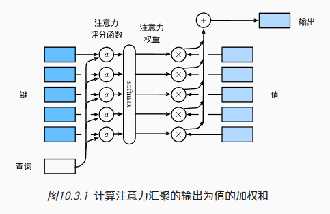

## Self-Attention

Self-Attention 是 Transformer中最核心的部分。

$Attention(Q,K,V)=softmax(\dfrac{QK^T}{\sqrt{d_k}})V$

这种的形式的公式其意义到底是什么？先看$QK^T$:  

$a \cdot b =a^Tb =\sum_{i=1}^{n} a_i b_i =||a||\;||b||\;cos\theta$  


向量的内积，表征一个向量在另一个向量上的投影。投影的值大，说明两个向量相关度高。如果两个向量夹角是九十度，那么这两个向量线性无关。

上述的$a$和$b$均为列向量，而公式里的$Q$ $K$是行向量（batch * len * d_k ）所以点积写成 $QK^T$。

  
Q K 的内积 表示了 Q中每个单词 与 K的每个单词 的关联度矩阵（注意力评分），softmax进行归一化处理使得整体的关联度之和为1

进行softmax之前需要对attention进行scaled（为什么要除以$\sqrt{d_k}$）?  
the dot products grow large in magnitude, pushing the softmax function into regions where it has extremely small gradients  
当d_k较大时，点积的幅度也就变大，容易进入softmax函数的梯度消失区域。


```py
class ScaledDotProductAttention(nn.Module):
    ''' Scaled Dot-Product Attention '''

    def __init__(self, attn_dropout=0.1):
        super().__init__()
        self.dropout = nn.Dropout(attn_dropout)

    def forward(self, q, k, v, mask=None):
        # shape = batch * head * len * d_k 
        # q k 计算点积，所以向量的维度 d_q 和 d_k 需要保证相等
        assert q.size(-1) == k.size(-1)

        d_k = k.size(-1)

        #计算注意力, 这里要计算单词间的关联度，最后两个维度必须保证是 len * d_k
        # attn = [batch * head * len * d_k] dot [batch * head * d_k * len]
        #      = batch * head * len = batch * head * attn_score
        attn = torch.matmul(q / math.sqrt(d_k), k.transpose(-2, -1))

        # 如果存在要进行mask的内容，则将注意力评分中需要屏蔽的部分替换成一个很大的负数
        if mask is not None:
            attn = attn.masked_fill(mask == 0, -1e9)
        # 对 attn_score 做归一化
        attn = self.dropout(F.softmax(attn, dim=-1))
        output = torch.matmul(attn, v)

        return output, attn
```
$X * W_{linear}^q=Q$  
$X * W_{linear}^k=K$  
$X * W_{linear}^v=V$ 

#### 多头注意力
当给定相同的查询、键和值的集合时， 我们希望模型可以基于相同的注意力机制学习到不同的行为，然后将不同的行为作为知识组合起来，允许注意力机制组合使用查询、键和值的不同子空间表示。

```py
class MultiHeadAttention(nn.Module):
    ''' Multi-Head Attention module '''

    def __init__(self, n_head, d_model, d_k, d_v, dropout=0.1):
        super().__init__()

        self.n_head = n_head
        # k 和 v 通过注意力权重进行交互，所以d_k和d_v可以有不同的维度
        self.d_k = d_k
        self.d_v = d_v 

        self.w_qs = nn.Linear(d_model, n_head * d_k, bias=False)
        self.w_ks = nn.Linear(d_model, n_head * d_k, bias=False)
        self.w_vs = nn.Linear(d_model, n_head * d_v, bias=False)
        # 对 注意力输出 进行特征整理
        self.fc = nn.Linear(n_head * d_v, d_model, bias=False)

        self.attention = ScaledDotProductAttention()

        self.dropout = nn.Dropout(dropout)
        # 最后的维度size 进行标准化，趋近于标准正太分布 
        self.layer_norm = nn.LayerNorm(d_model, eps=1e-6)


    def forward(self, q, k, v, mask=None):

        d_k, d_v, n_head = self.d_k, self.d_v, self.n_head
        # batch * len * d_model
        sz_b, len_q, len_k, len_v = q.size(0), q.size(1), k.size(1), v.size(1)

        residual = q

        # 输入尺寸 batch x len x d_model
        # Separate different heads: b x lq x n x dv
        q = self.w_qs(q).view(sz_b, len_q, n_head, d_k)
        k = self.w_ks(k).view(sz_b, len_k, n_head, d_k)
        v = self.w_vs(v).view(sz_b, len_v, n_head, d_v)

        # Transpose for attention dot product: batch x head x len x d_k
        # 计算注意力要保证最后两个维度是 句子长度 * 单词维度
        q, k, v = q.transpose(1, 2), k.transpose(1, 2), v.transpose(1, 2)

        if mask is not None:
            # batch * len -> batch * 1 * len
            # 添加一个 head 维度，通过广播机制可以mask所有的head
            mask = mask.unsqueeze(1)   # For head axis broadcasting.


        q, attn = self.attention(q, k, v, mask=mask)

        # Transpose to move the head dimension back: b x lq x n x dv
        # Combine the last two dimensions to concatenate all the heads together: b x lq x (n*dv)
        # 把维度 batch x head x len x d_k 还原成 batch x len x d_model, 方便残差
        q = q.transpose(1, 2).contiguous().view(sz_b, len_q, -1)
        q = self.dropout(self.fc(q))
        q += residual
        
        q = self.layer_norm(q)

        return q, attn
```


#### PositionwiseFeedForward
定位前馈网络
虽然线性变换在不同位置上是相同的，但它们在不同层之间使用不同的参数。另一种描述方法是将其描述为两个核大小为1的卷积。（原文）  
 
扩展阅读：[聊一聊transformer里的FFN](https://zhuanlan.zhihu.com/p/685943779)  
```
后续的研究表明是Knowledge Neurons。tokens在前一层attention做global interaction之后，通过FFN的参数中存放着大量training过程中学习到的比较抽象的knowledge来进一步update。目前有些studies是说明这件事的，如   
《Transformer Feed-Forward Layers Are Key-Value Memories》  
《Knowledge Neurons in Pretrained Transformers》 
```

```
MoEfication: Transformer Feed-forward Layers are Mixtures of Experts  
FFN 是一种混合专家模型？   
刘知远团队的论文，其实一直以来，神经网络就存在稀疏激活的现象，也就是在推理的时候，其实只有极小一部分参数参与了计算。这篇论文则通过 MoE 的思想来将 FFN 层拆分成了多个专家，并且新增了一个路由模块来确定推理的时候来挂哪个专家的门诊：）这么做完之后，在提升推理速度的同时，效果依然能保持原来的95%以上。
```

```py
class PositionwiseFeedForward(nn.Module):
    ''' A two-feed-forward-layer module '''
    def __init__(self, d_in, d_hid, dropout=0.1):
        super().__init__()
        self.w_1 = nn.Linear(d_in, d_hid) # position-wise
        self.w_2 = nn.Linear(d_hid, d_in) # position-wise
        self.layer_norm = nn.LayerNorm(d_in, eps=1e-6)
        self.dropout = nn.Dropout(dropout)

    def forward(self, x):

        residual = x

        x = self.w_2(F.relu(self.w_1(x)))
        x = self.dropout(x)
        x += residual

        x = self.layer_norm(x)

        return x
```


#### 组装一个Encoder Layer
```py
class EncoderLayer(nn.Module):
    ''' Compose with two layers '''
    # d_model输入特征维度，d_hid 为 PositionwiseFeed 的隐藏层维度
    def __init__(self, d_model, d_hid, n_head, d_k, d_v, dropout=0.1):
        super(EncoderLayer, self).__init__()
        self.slf_attn = MultiHeadAttention(n_head, d_model, d_k, d_v, dropout=dropout)
        self.pos_ffn = PositionwiseFeedForward(d_model, d_hid, dropout=dropout)

    def forward(self, x, slf_attn_mask=None):
        y, attn = self.slf_attn(
            x, x, x, mask=slf_attn_mask)
        y = self.pos_ffn(y)
        return y, attn
```

#### 组装一个Decoder Layer

```py
class DecoderLayer(nn.Module):
    ''' Compose with three layers '''

    def __init__(self, d_model, d_inner, n_head, d_k, d_v, dropout=0.1):
        super(DecoderLayer, self).__init__()
        self.self_attn = MultiHeadAttention(n_head, d_model, d_k, d_v, dropout=dropout)
        self.cross_attn = MultiHeadAttention(n_head, d_model, d_k, d_v, dropout=dropout)
        self.pos_ffn = PositionwiseFeedForward(d_model, d_inner, dropout=dropout)

    def forward(self, x, encoder_y, slf_attn_mask=None, cross_attn_mask=None):
        # decoder 自注意力
        decoder_y, decoder_attn = self.self_attn(x, x, x, mask=slf_attn_mask)
        
        # 交叉注意力层
        # 这里的 decoder_y, encoder_y, encoder_y 理解成 Xq Xk Xv
        # 用 decoder 的 q 去 查询 encode 的 k-v 里的关联信息
        decoder_y, cross_attn = self.cross_attn(
            decoder_y, encoder_y, encoder_y, mask=cross_attn_mask)
        
        decoder_y = self.pos_ffn(decoder_y)
        return decoder_y, decoder_attn, cross_attn
```


#### 组装整个Encoder模块
```py
class Encoder(nn.Module):
    ''' A encoder model with self attention mechanism. '''

    def __init__(self, n_layers, d_model, n_head, hidden_scaler=4):

        super().__init__()

        assert d_model % n_head == 0
        # 512 / 8 = 64
        d_k = d_v = d_model //  n_head

        # 输入前 先标准化
        self.dropout = nn.Dropout(0.1)
        self.layer_norm = nn.LayerNorm(d_model, eps=1e-6)

        self.layer_stack = nn.ModuleList([
            EncoderLayer(d_model, d_model * hidden_scaler, n_head, d_k, d_v)
            for _ in range(n_layers)])
        

    def forward(self, src_vecs, src_mask):

        encoder_y = self.layer_norm(self.dropout(src_vecs))

        for enc_layer in self.layer_stack:
            encoder_y, enc_slf_attn = enc_layer(encoder_y, slf_attn_mask=src_mask)

        return encoder_y,
```

```py
class Decoder(nn.Module):
    ''' A decoder model with self attention mechanism. '''

    def __init__(self, n_layers, d_model, n_head, hidden_scaler=4):

        super().__init__()

        assert d_model % n_head == 0
        # 512 / 8 = 64
        d_k = d_v = d_model //  n_head

        self.dropout = nn.Dropout(0.1)
        self.layer_norm = nn.LayerNorm(d_model, eps=1e-6)

        self.layer_stack = nn.ModuleList([
            DecoderLayer(d_model, d_model * hidden_scaler, n_head, d_k, d_v)
            for _ in range(n_layers)])

    def forward(self, target_vecs, encoder_y, src_mask, tgt_mask):

        dec_output = self.layer_norm(self.dropout(target_vecs))

        for dec_layer in self.layer_stack:
            dec_output, decoder_attn, cross_attn = dec_layer(
                dec_output, encoder_y, slf_attn_mask=tgt_mask, cross_attn_mask=src_mask)

        return dec_output,
```

```py
class Generator(nn.Module):
    # vocab: tgt_vocab
    def __init__(self, d_model, vocab):
        super(Generator, self).__init__()
        # decode后的结果，先进入一个全连接层变为词典大小的向量
        self.proj = nn.Linear(d_model, vocab)

    def forward(self, x):
        # 然后再进行log_softmax操作(在softmax结果上再做多一次log运算)
        return F.log_softmax(self.proj(x), dim=-1)
```
LogSoftmax 函数的输出是一个 K 维向量，其中每个元素的取值范围在负无穷到 0 之间。由于 LogSoftmax 函数在计算交叉熵损失时，会将原始输出先进行对数转换，因此可以避免 Softmax 函数在较小和较大值时出现数值上溢和下溢的情况。


```py
class Transformer(nn.Module):
    def __init__(self, src_vocab, tgt_vocab, n_layers=6, d_model=512, n_head=8):
        super(Transformer, self).__init__()
        self.encoder = Encoder(n_layers, d_model, n_head)
        self.decoder = Decoder(n_layers, d_model, n_head)
        self.src_embed_pos = nn.Sequential(InputEmbedding(d_model, src_vocab), PositionalEncoding(d_model))
        self.tgt_embed_pos = nn.Sequential(InputEmbedding(d_model, tgt_vocab), PositionalEncoding(d_model))
        self.generator = Generator(d_model, tgt_vocab)

    def encode(self, src, src_mask):
        return self.encoder(self.src_embed_pos(src), src_mask)

    def decode(self, encoder_y, src_mask, tgt, tgt_mask):
        return self.decoder(self.tgt_embed_pos(tgt), encoder_y, src_mask, tgt_mask)

    def forward(self, src, tgt, src_mask, tgt_mask):
        # encoder的结果作为decoder的memory参数传入，进行decode
        encoder_y = self.encode(src, src_mask)
        return self.decode(encoder_y, src_mask, tgt, tgt_mask)
```


https://github.com/jadore801120/attention-is-all-you-need-pytorch

https://jalammar.github.io/illustrated-transformer/